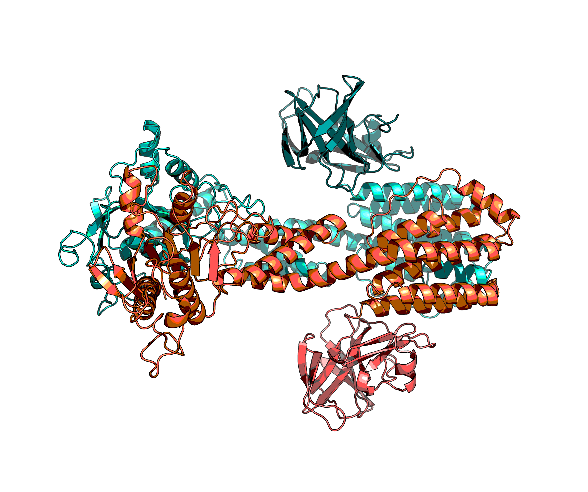
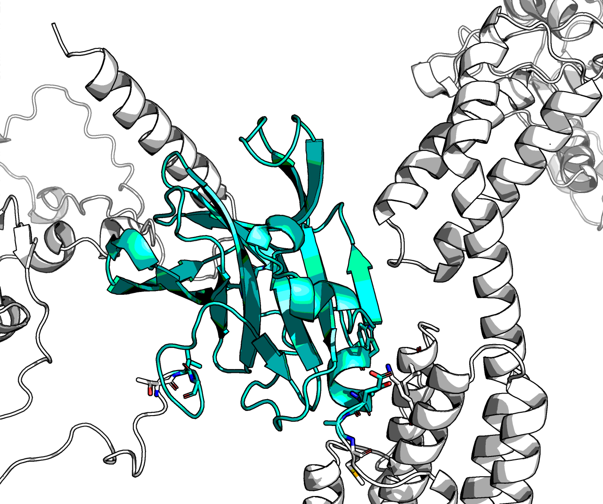
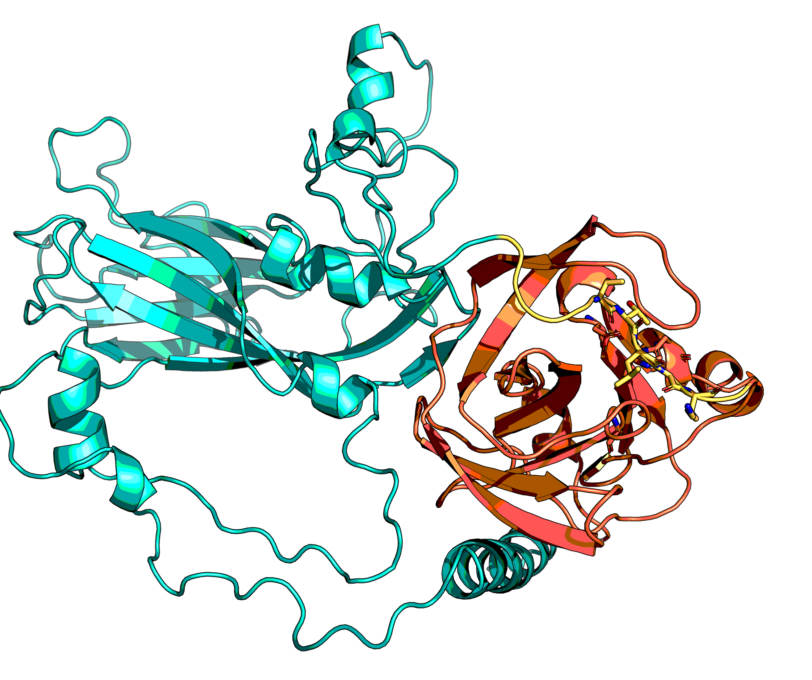
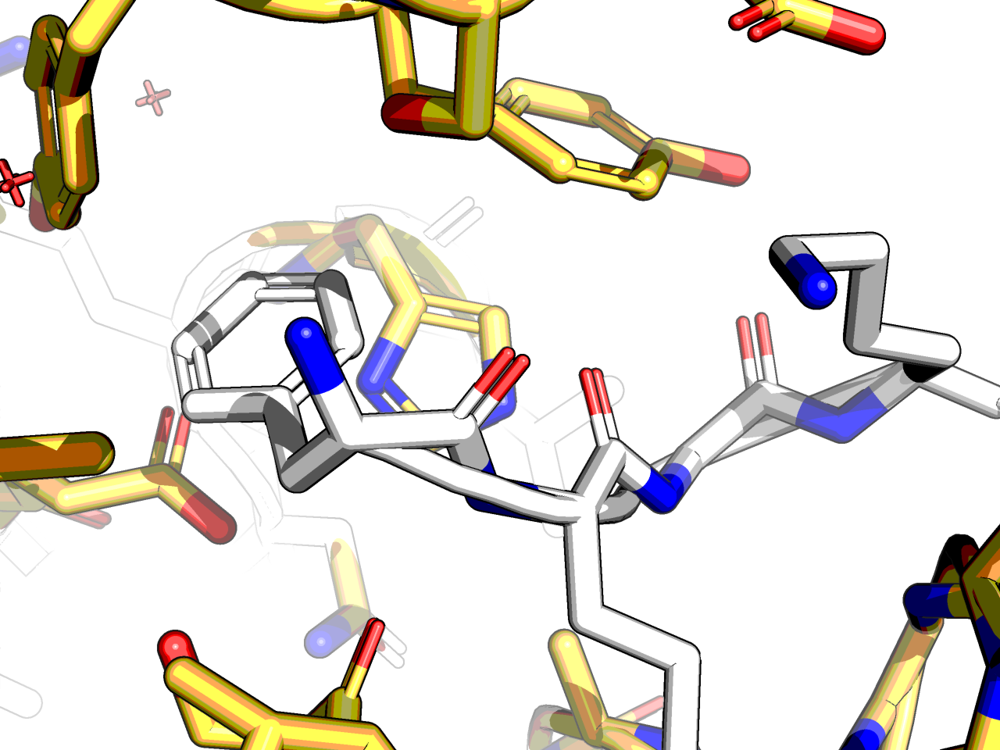
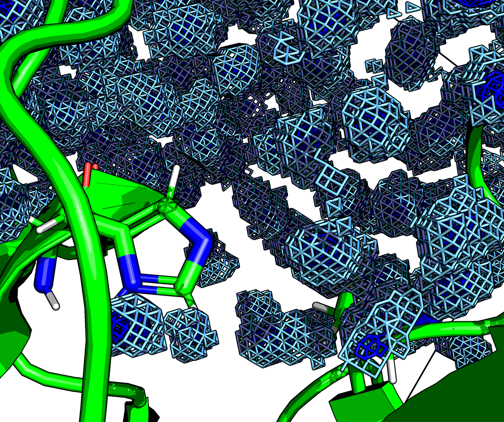
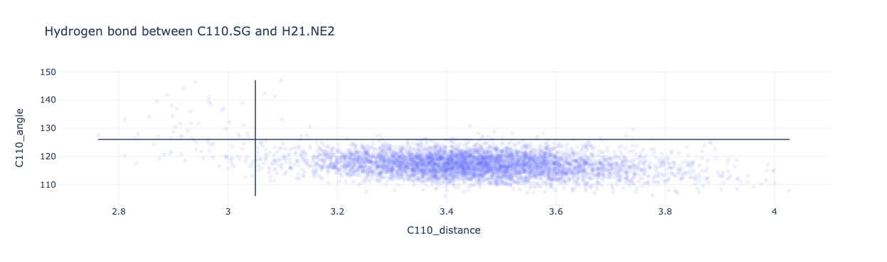
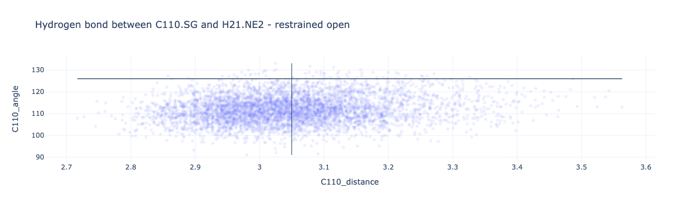

## Dimer

In Uniprot entry B9VUU3|POLG_HE71
there is written it may be a dimer.
https://www.uniprot.org/uniprotkb/B9VUU3/entry#:~:text=Protease%202A-,Homodimer.,-By%20Similarity

The crystal structure is monomeric, so maybe its P2 that is dimer?

AF2 prediction:

P2 (POLG_HE71:1013-1440, turquoise and coral) dimerises but 
2A protease (teal and crimson) are not brought close together.

## Interactions with capsid VP4

Given how SETD3 in PDB:7LMS (Peters _et al_ 2022) seems to make Y89 open and the catalytic residues align,
what if VP4 formed protein–protein interactions?

There are no inter-domain interactions between VP4 and 2A (or P2).
The cleavage site however is not in the active site as all PDBs.
The fragment bound in the two structures (PDB:4FVD and PDB:7DA6) is shorter than a hexamer,
so AF2 did not learn it.
Furthermore, the N-terminus of 2A is _learnt_ from two crystal structures were it is flappy.
So AF2 is learning this from crystals and may not be able to reconcile this.
Potentially why the cleaved loop is not in the active site in the five models.

## Model of cleavage poised 2A

PDB:4FVD rearranged and remodelled in PyRosetta.
Aligned with AF2 model and remodelled in the loop. Relaxed.
See [join.ipynb](join.ipynb) and [collage](collage.ipynb) for code.

There is an interaction formed between VP4 and 2A. But it is hydrophobic in nature.

It was relaxed with a constraint to debunch up the termini, but it did not work:
The N-terminus of VP4 likes to stick!
The interactions are weak and maybe VP4 N-terminal is transmembrane (not checked),
so maybe best ignoring that helix.

AF2 should have picked any evolutionary covariance between 2A and VP4 _domains_,
but may have been misled by the N-terminus of the two structures.
So the interactions are real —it has no space otherwise—, but is weak.

## EIF4G1·EIF4E·2A

EIF4G1 is disoreded where 2A binds, but it next to the EIF4E binding region.
Complex of EIF4G1·EIF4E·2A shows there is some signal but it's messy.
This is either a sticky patch or EIF4E does indeed bind allowing EIF4G1 to be cleaved.
There is no evolutionary covariance, which could be added manually (i.e. virus and host evolve together).

## 7DA6 to x0310

> [peptide-conned.ipynb](peptide-conned.ipynb)

In the first subsection of the screen hits were only found in P1, not P2.
Some hits did flip Y89 from closed (product bound form) to open (substrate form).
In the PDB:7DA6 the ligand (chain C) causes the loop to be more open than in x0310.

This is a problem because for medchem review all virtual compounds are appraised in a Fragalysis template,
so clashes will result in the virtual compounds being discarded out of safety.

Unfortunately, the benzyl ring of 7DA6's Phe-1 clashes slightly.

This was minimised with lots of constraints in PyRosetta, but there is no way to fix this. The protein needs to move.

## MD

### Water map

See [simulation.ipynb](simulation.ipynb)

Aim: create watermap for improved scoring

Add details

### Position of catalytic residues

The position of Y89 determines if the Cys and His align well for reactivity (crossair):

Y89 closed:

Y89 open:

## Footnote

Sequences mentioned

2A protease

    B9VUU3|POLG_HE71|863-1012
    GKFGQQSGAIYVGNFRVVNRHLATHNDWANLVWEDSSRDLLVSSTTAQGCDTIARCNCQTGVYYCNSRRKHYPVSFSKPSLIYVEASEYYPARYQSHLMLAQGHSEPGDCGGILRCQHGVVGIVSTGGNGLVGFADVRDLLWLDEEAMEQ

Capsid protein before it

    B9VUU3|POLG_HE71|566-862
    GDRVADVIESSIGDSVSRALTQALPAPTGQNTQVSSHRLDTGKVPALQAAEIGASSNASDESMIETRCVLNSHSTAETTLDSFFSRAGLVGEIDLPLEGTTNPNGYANWDIDITGYAQMRRKVELFTYMRFDAEFTFVACTPTGEVVPQLLQYMFVPPGAPKPDSRESLAWQTATNPSVFVKLSDPPAQVSVPFMSPASAYQWFYDGYPTFGEHKQEKDLEYGACPNNMMGTFSVRTVGTSKSKYPLVVRIYMRMKHVRAWIPRPMRNQNYLFKANPNYAGNSIKPTGTSRTAITTL

P2 protein after it

    B9VUU3|POLG_HE71|1013-1440
    GVSDYIKGLGDAFGTGFTDAVSREVEALKSYLIGSEGAVEKILKNLIKLISALVIVIRSDYDMVTLTATLALIGCHGSPWAWIKAKTASILGIPIAQKQSASWLKKFNDMANAAKGLEWVSNKISKFIDWLKEKIVPAAKEKVEFLNNLKQLPLLENQISNLEQSAASQEDLEVMFGNVSYLAHFCRKFQPLYATEAKRVYALEKRMNNYMQFKSKHRIEPVCLIIRGSPGTGKSLATGIIARAIADKYHSSVYSLPPDPDHFDGYKQQVVTVMDDLCQNPDGKDMSLFCQMVSTVDFIPPMASLEEKGVSFTSKFVIASTNATNIIVPTVSDSDAIRRRFYMDCDIEVTDSYKTDLGRLDAGRAAKLCSENNTANFKRCSPLVCGKAIQLRDRKSKVRYSVDTVVSELIREYSNRSAIGNTIEALFQ
