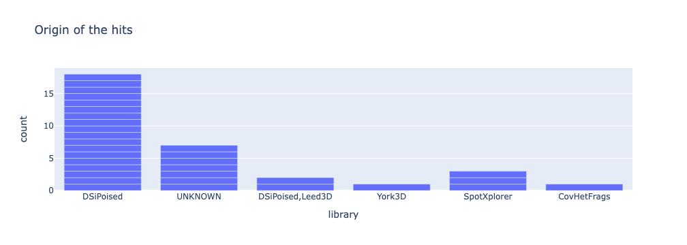
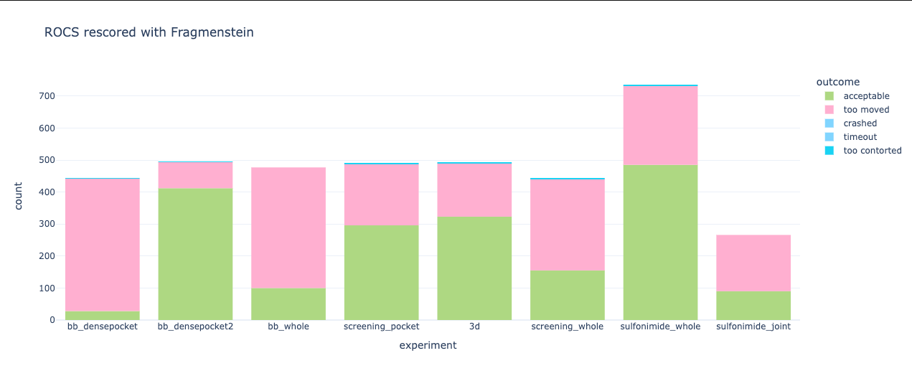
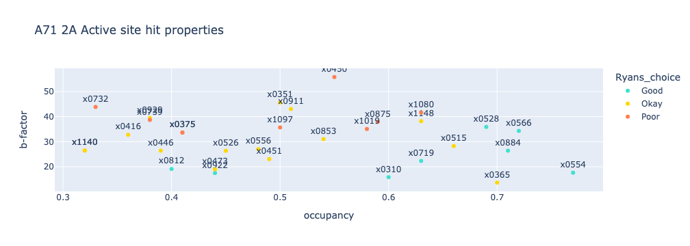

## Extraction

This series was provided as a PyMOL session file.

> code/extract.ipynb

The bond order was absent. The hits were matched to the library (`AllChem.AssignBondOrdersFromTemplate`) 
or `OpenBabel openbabel.OBMol.PerceiveBondOrders` if not found.

## Relax

> code/relax.ipynb

x0310 template (`x0310_apo.pdb`) was remade with tweaks.

## Rocs
Multiple ROCS runs were performed with the following datasets:

* Enamine_Building_Block.oeb.gz
* Enamine_screening_collection_202312.oeb.gz
* Enamine_3D-shape.oeb.gz
* Enamine_sulfonamides.oeb.gz
* Carboxylic Acid Bioisosteres_1817cmpds.oeb.gz

But not all were brought trough to the next stage.

Fragmenstein filtering against clashes (code/rescore_rocs/ipynb).

## Footnote

Is B-factor or occupancy a good metric for the quality of the hit and thus how much to weigh its derivatives?

Ryan Lithgo categories the hits based on the "quality" in Coot.
I.e. how easy were they to see.

