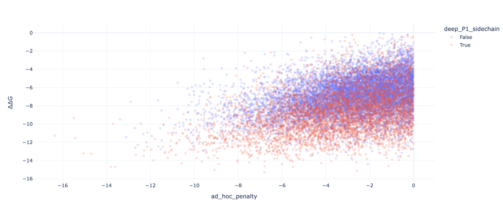
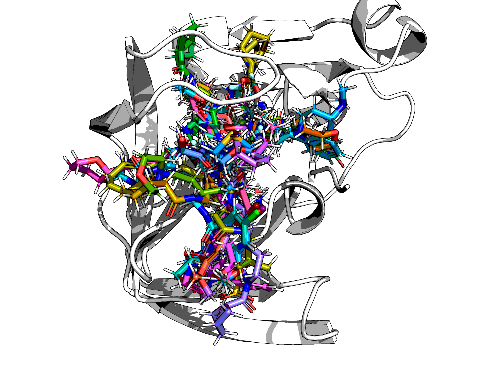
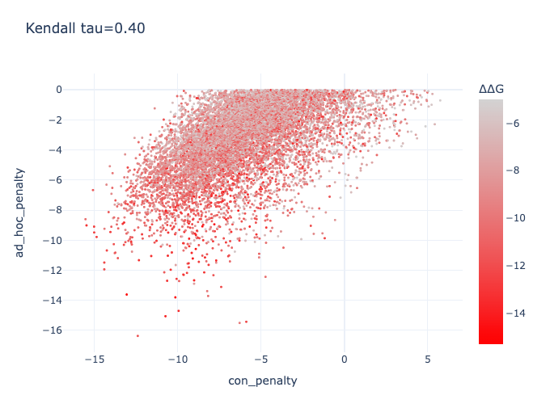
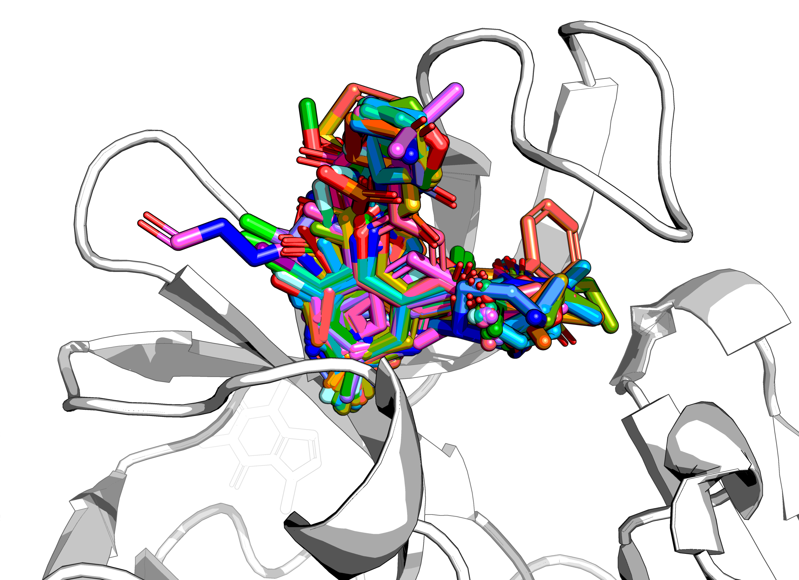
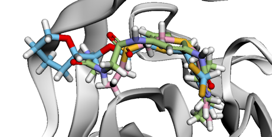

## Extraction

This series was provided as a PyMOL session file.

> code/extract.ipynb

The bond order was absent. The hits were matched to the library (`AllChem.AssignBondOrdersFromTemplate`) 
or `OpenBabel openbabel.OBMol.PerceiveBondOrders` if not found.

## Relax

> code/relax.ipynb

x0310 template (`x0310_apo.pdb`) was remade with tweaks.

## Fragmenstein

Analogues of 2 and 3 way mergers gave a lot of catalogue virtual compounds. 250k.
75,322 were accepted by Fragmenstein.
16,189 had a negative multifactor score.
13,554 have a Tanimoto similarity of 0.8 or less to any other.

Curiously, the deeper part of the P1 sidechain pocket is populated by better ∆G compounds.

    [('hbond', 'SER', 105),
     ('hydroph_interaction', 'VAL', 124),
     ('halogenbond', 'SER', 105),
     ('hbond', 'VAL', 124),
     ('halogenbond', 'VAL', 124)]

The multifactor score does a weird split:

Ad actually I want S105 + V124, so I will submit two datasets.

The outliers are many.
A conservative penalty was also tried with Butina clustering with a 0.7 threshold (Morgan, 3, 2048):

|                               |   default | conservative |
|:------------------------------|----------:|-------------:|
| ∆∆G                           |      1    |            1 |
| N rotatable bonds             |      1    |            1 |
| strain per HA                 |      1    |            1 |
| interaction uniqueness metric |     -2.5  |            0 |
| N unconstrained atoms         |      0.2  |         0.25 |
| N constrained atoms           |     -0.05 |         -0.5 |
| N interactions                |     -1.5  |         -0.5 |
| N interactions lost           |      2    |            2 |
| max hit Tanimoto              |     -0.5  |         -0.5 |
| N PAINS                       |      5    |            5 |

This changes the dataset substantially:

The compounds are small and as a result there's a lot of variation on the indole ring theme,
while the all cluster in the P1 pocket.

About crossing to the upstream pocket, only three compounds do this
(`PV-004088162110`,  `Z1715535807`, `Z1607665206`)

## Rocs
Multiple ROCS runs were performed with the following datasets:

* Enamine_Building_Block.oeb.gz
* Enamine_screening_collection_202312.oeb.gz
* Enamine_3D-shape.oeb.gz
* Enamine_sulfonamides.oeb.gz
* Carboxylic Acid Bioisosteres_1817cmpds.oeb.gz

But not all were brought trough to the next stage.

Fragmenstein filtering against clashes (code/rescore_rocs/ipynb).

## Footnote

Is B-factor or occupancy a good metric for the quality of the hit and thus how much to weigh its derivatives?

Ryan Lithgo categories the hits based on the "quality" in Coot.
I.e. how easy were they to see.

