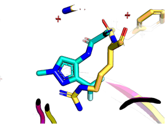
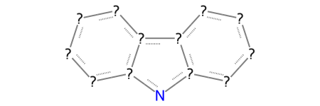
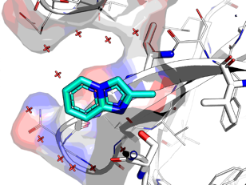
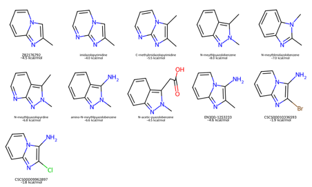
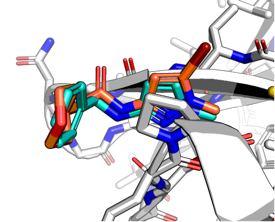
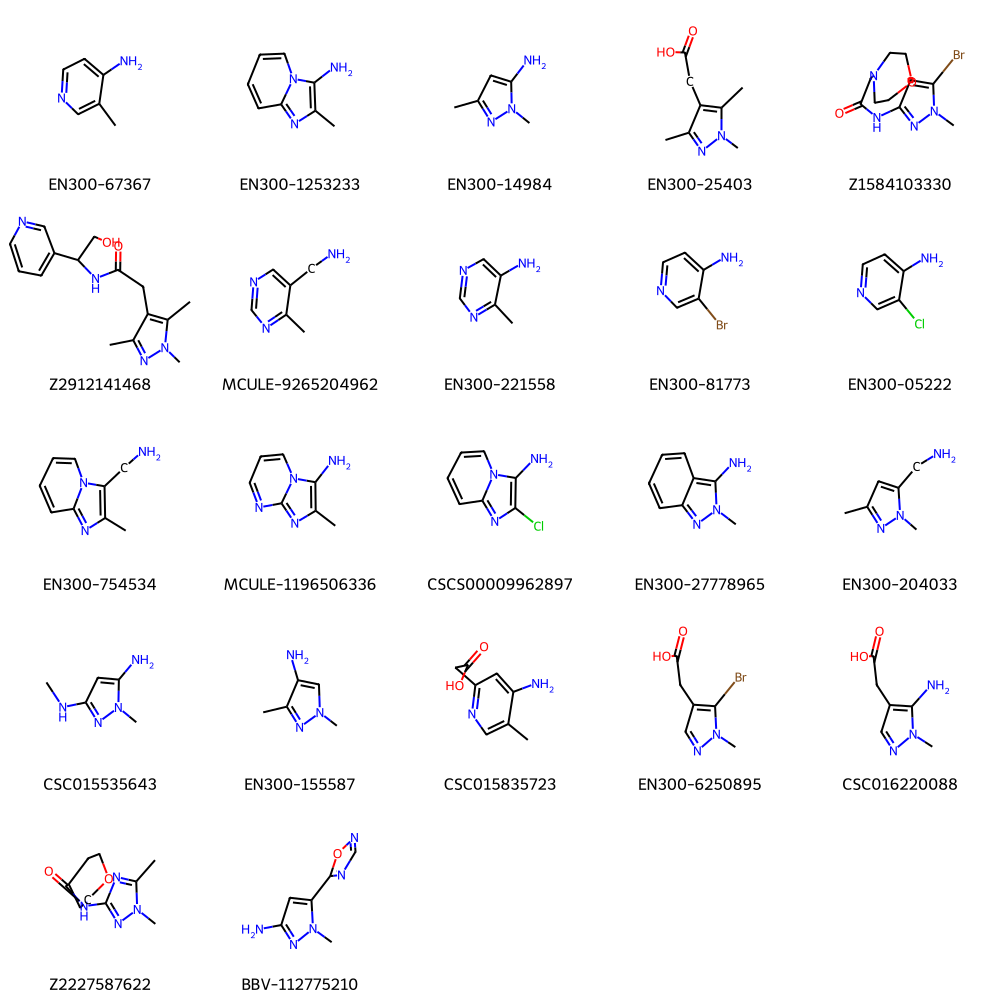
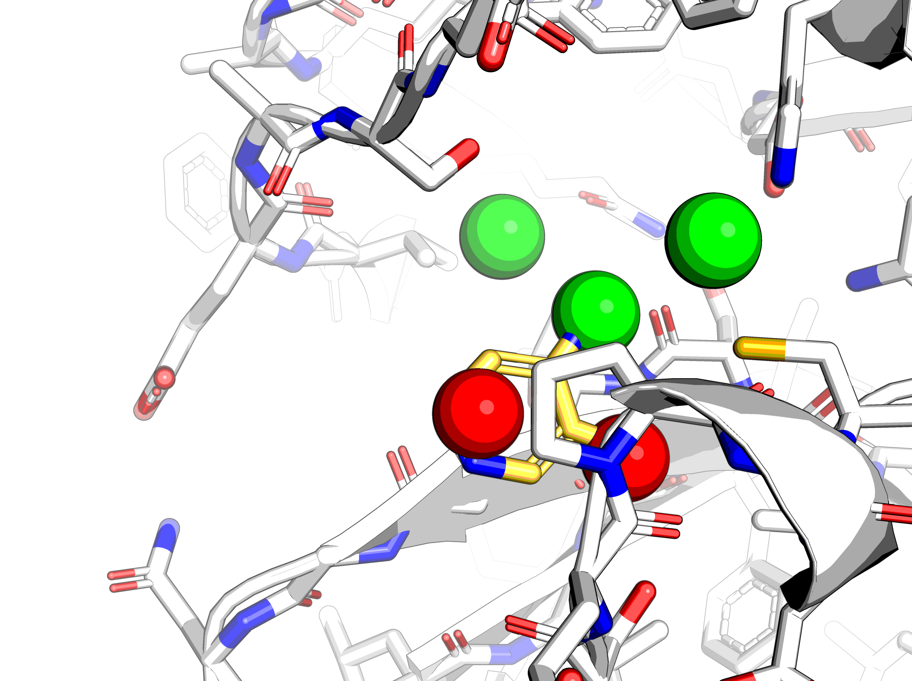
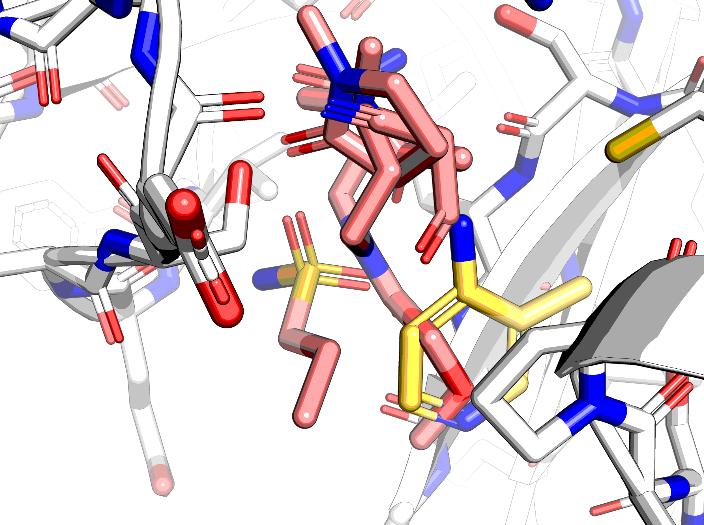
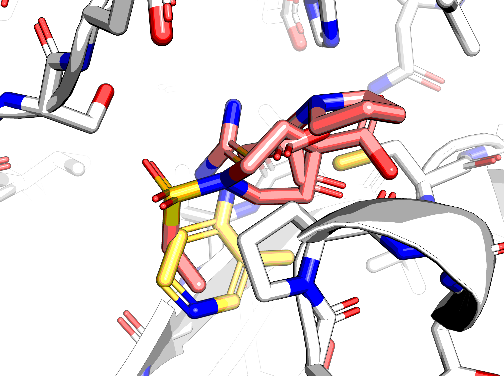

## Iteration 3
This iteration does not have to be done automated, but I can design the compounds rationally.
The compounds are to be made on the robot.

### P1 pocket

### Native
The P1 residue of the substrate is an arginine.
The arginine’s guanidine in PDB:7DA6 (mustard) is in what would be a cryptic pocket in our system.
The hit that comes closest is x1431 (turquoise), with a difluoromethyl substituent, but is not quite there.

Ryan has inspected the structure in Coot and says to be weary of PDB:7DA6.
However, that is what binds there: a positively charged delocalised group.
 
### Trend
There is a trend of an acceptor nitrogen, 
especially on a N-aryl-pyrazole scaffold for this P1 sidechain pocket thanks to a SER105 hydroxyl interaction. 
However, this is not clear cut and universal, hence this investigation into what does work.

### Benzyl note
A parenthesis needs to be raised for the covalent series.
These are vinyl phenyl ketone derivatives and the benzo group is on the other side of most aza-bicyclics.

Whether a pyrazole/indole version of a carbazole works is a moot point as I was unable to find a BB.

 
### Counter to the trend
However, not all fragments that obey the pattern bind.
One interest case is x1209a, which does not bind in the pocket. One explanation could be that the methyl group is important. x1209 and x1180 are a 2-bromo-imidazole and a 2-chloro-imidazole that bind there, whereas no carryover imidazole (Ni-NTA) was found, so a hydrophobic group there may be important. 

In fact, the closest thing to an except is an oxygen in the benzodioxole of x0351, which was a hit flagged as problematic. 
In addition to carbon, chloro, floro, bromo, a nitrile group is present in x1169 (cyano-oxazole).
Methyl, but not ethyl or larger as it’s a snug pocket —unless opened (cf. covalents).

Under this hypothesis, two compounds ought to have bound, but did however, Z’4612 is one of those compounds that was in the Enamine 860 version of the DSiPoised and not the original, so might be absent in XChem’s version.

Without running MD, the predicts are too unreliable:

A note in point is that methyl group of x0487 (pyridine) cannot be changed to Br or Cl according to Fragmenstein (+4 kcal/mol), but the score are too inconsistent.

### Groups
There are very few options with the base scaffolds (azole, benzazole, pyridine) to have one of the following groups,

* acceptor aza group
* methyl/fluoro/chloro/bromo ("ortho" in 5-membered rings, meta in pyridine)
* "meta" in 5-membered rings / para in pyridine expansion vector: amino, aminomethyl, chloro, bromo, boronic ester, carboxylic acid

Turns out that amino is the best choice by far.
The are two hits that would suggest suzuki as 

## Curveball
x0365 (turquoise) is an interesting hit, it **extends past the pocket** and wraps a proline sidechain.
Proline on a turn is not mutatable, so this compound might be worth exploring, but is antisocial in respect to the pyrazole scaffold. It contains a N-phenylmethyl substituent on the amine. Changing the bridging amine to an amide opens up more options, but breaks the angle, so adding a carbon and changing to a morpholino or oxane allows a reactive bromine. The benzene is not forming aromatic interactions, just shielding the proline/glutamate sidechain, so should be better.
* As is, bromine will act as an EWG so may change the properties of the pyrazole and might form interactions with cysteine…
* Suzuki reaction or buckwald-Hartwig variant

### Choices

With the caveat that the scores are funky, these ought to be okay and explore a few things.
Specifically, amino at meta position of four main scaffolds:

* pyridine -> `EN300-67367`
* imidazolopyridine -> `EN300-1253233`
* pyrazole -> `EN300-14984`
* benzopyrazole (combination of above two) -> `EN300-27778965`.

The aminomethyl version of these is not always available:

* pyridine -> pirimidine (`EN300-221558`) -> `MCULE-9265204962`
* imidazolopyridine -> `EN300-754534`
* pyrazole -> `EN300-204033`
* benzopyrazole -> X

The pyrazole can have the amino group in the 'wrong' place: `EN300-155587`
(This might actually be a good thing, as it might be a better fit for the pocket due to weird chage stuff).

Depending on the price, there are some other options.

For some there is chloro/bromo equivalents that may be worth testing when affinity data can be collected,
along with scaffold variants (e.g. aza/amino in `MCULE-1196506336` and `CSC015535643`)

Additionally, `x1346` can be stripped to `Z2912141468` (with two minor tweaks),
then to `EN300-25403` carboxylic acid. If both of these bind, it might be an interesting vector,
albeit outside the substrate envelope.

The `x0365` hit also expands past the pocket as discussed.
`Z1584103330` is a morpholino variant —unfortunately it is "meta"-bromo.
This can be stripped down to `EN300-6250895` (carboxylic acid).
Where the above compounds success, `CSC016220088` is the base carboxylic acid with amine,
but would require protection chemistry. The pyridine version is `CSC015835723`.
`Z2227587622` is a compound that could fit either way as x0365 or x1346: crude test for affinity.

For the question of 'what is a merger that can be done by suzuki coupling?',
`BBV-112775210` is a merger of two hits. But I did not do a docking screen for Suzukiable compounds.

| Compound ID | SMILES | Description | Functional Group | Category |
|-------------|--------|-------------|------------------|----------|
| EN300-67367 | Cc1ncncc1N | x0487 without amide | amine (on arene) | base S1 compound #1 |
| MCULE-9265204962 | Cc1ncncc1CN | like #1 but aminomethyl | amine | test of #1 |
| EN300-221558 | Cc1ncncc1N | x0487 without amide. pyridine to pyrimidine | amine (on arene) | test of #1 |
| EN300-81773 | Nc1ccncc1Br | x0487 without amide. methyl to bromine | amine (on arene) | test of #1 |
| EN300-05222 | Nc1ccncc1Cl | x0487 without amide. methyl to bromine | amine (on arene) | test of #1 |
| EN300-1253233 | CC1=C(N)N(C=CC=C2)C2=N1 | x0443 with amine | amine (on arene) | base S1 compound #2 |
| EN300-754534 | Cc1nc2ccccn2c1CN | like #2 but aminomethyl | amine | test of #1 |
| MCULE-1196506336 | Cc1nc2ncccn2c1N1 | x0443 with amine. aza | amine (on arene) | test of #2 |
| CSCS00009962897 | NC1=C(Cl)N=C2C=CC=CN12 | x0443 with amine. chloro | amine (on arene) | test of #2 |
| EN300-27778965 | Cn1nc2ccccc2c1N | x0443 with amine. pyrazole | amine (on arene) | test of #2 |
| EN300-14984 | Cc1cc(N)n(C)n1 | x1346 pyrazole with amine | amine (on arene) | base S1 compound #3 |
| EN300-204033 | Cc1cc(CN)n(C)n1 | like #3 but aminomethyl | amine | test of #3 |
| CSC015535643 | CNc1cc(N)n(C)n1 | x1346 pyrazole with amine and N-methylamine | amine (on arene) | test of #3 |
| EN300-155587 | Cc1nn(C)cc1N | x1346 pyrazole with amine in different spot | amine (on arene) 'wrong' place | test of #3 |
| EN300-25403 | Cc1nn(C)c(C)c1CC(=O)O | x1346 pyrazole carboxylic acid only | carboxylic acid | base S1 compound #4 |
| CSC015835723 | Cc1cnc(CC(=O)O)cc1N | x1346 carboxylic acid on x0487 | carboxylic acid | test of #4 |
| EN300-6250895 | Cn1ncc(CC(=O)O)c1Br | x1346 pyrazole with Br and carboxylic | carboxylic acid + bromo | test of #4 |
| CSC016220088 | Cn1ncc(CC(=O)O)c1N | x1346 pyrazole with amino and carboxylic | carboxylic acid + amino | test of #4 (would require protection) |
| Z1584103330 | C2N(CC(NC1=NN(C)C(Br)=C1)=O)CCOC2 | x0365 amido oxane | bromo | base S1 compound #5 |
| Z2227587622 | C2C(C(NC1=NN(C)C(C)=N1)=O)CCOC2 | x0365 amido morpholino | test of #5 |
| BBV-112775210 | Cn1nc(N)cc1-c1ncno1 | x0501 (no with oxadiazole ring from other hit (Suzuki-able) | amino (other side) | test of #5 |
| Z2912141468 | CC1=NN(C)C(C)=C1CC(=O)NC(CO)C1=CC=CN=C1 | stripped x1346 | not robot | not base, #6 |

## Backbone side

Gold docking all BB under 200€/100mg, with 2 or fewer rotatable bonds, and two or more H-bond donors or acceptors.

Library: 303,087 => deck: 5003

Docked 10 replicates, box 9Å around the nitrogen of the others,
with a constraint (w=2) against a carboxylic acid derived from `x0487`.
VCs were then filtered by

* `Gold.Goldscore.Fitness` in the top 5% quartile
* 2 Å proximity to any of the following green dots, but not red dots.

This left 1830 compounds. These were filtered down to 1412 because:

* MMFF cannot deal with boron or silicon
* dicarboxylic acids

The N-methylamide form of these were placed with Fragmenstein based on the docked compound (without carboxylic acid),
and the `c-N` part of the amide group from x0487.
The `Victor.place` call was followed by a `vicky.MMFF_score(vicky.minimized_mol)` call,
to weed out the highly distorted cases, just in case they scored okay (unlikely).
The compounds were filtered as follows:

* MMFF score < 0 "kcal/mol"
* dG_bind < -5 "kcal/mol"
* RMSD total < 1. Å
* RMSD vs. methylamine < 1. Å

This gave 132 compounds, but 42 were unique, the rest were duplicates.
To aggravate matters many of the compounds follow the same pattern.
**Convergence is good, but I was not expecting this.**

The most common scaffold is cinnamic acid, with some variations, like phenylpropiolic acid.
They populate the underside of the tyrosine, which is a thermodynamic sink in the template used (apo x310).

In a different project Gold Score was tweaked to push Hbonding over hydrophobic interactions,
for better fragment binding predictions of XChem datasets,
this was not done here as it would be awkward to justify in a paper.

|      | name                |   Price_EUR_100mg |   comRMSD |   CN_RMSD |  ∆G_bind |   MMFF_score |   Gold.Goldscore.Fitness |   Gold.Goldscore.Internal.Vdw |   Gold.Goldscore.Internal.Torsion |   Gold.Goldscore.External.Vdw |   Gold.Goldscore.Internal.HBond |   Gold.Goldscore.External.HBond |
|-----:|:--------------------|------------------:|----------:|----------:|---------:|-------------:|-------------------------:|------------------------------:|----------------------------------:|------------------------------:|--------------------------------:|--------------------------------:|
|   35 | EN300-7444943 |               108 |      0.43 |      0.65 |       -7 |        -2.82 |                    51.42 |                         -0.16 |                             -2.43 |                         33.04 |                               0 |                            6    |
|   36 | EN300-16798   |                18 |      0.5  |      0.67 |   -36.93 |        -1.47 |                    51.41 |                         -5.39 |                             -4.16 |                         33.1  |                               0 |                            5.96 |
|   85 | EN300-1067793 |                18 |      0.53 |      0.8  |   -14.93 |        -9    |                    50.09 |                         -1.78 |                             -2.31 |                         28.44 |                               0 |                           12    |
|  168 | EN300-51296   |                94 |      0.57 |      0.47 |   -33.66 |       -13.03 |                    48.14 |                          0.15 |                             -2.14 |                         31.58 |                               0 |                            6    |
|  239 | EN300-331721  |                18 |      0.46 |      0.66 |   -21.65 |        -4.33 |                    47.18 |                         -0.11 |                             -2.72 |                         30.8  |                               0 |                            4.84 |
|  299 | EN300-103435  |                53 |      0.5  |      0.71 |   -24.15 |       -20.68 |                    46.57 |                         -2.82 |                             -3.02 |                         31.04 |                               0 |                            5.26 |
|  304 | EN300-146788  |               103 |      0.46 |      0.78 |   -16.73 |       -13.8  |                    46.54 |                         -0.11 |                             -0.81 |                         29.78 |                               0 |                            6    |
|  379 | EN300-84745   |               115 |      0.55 |      0.55 |   -29.79 |        -1.59 |                    45.93 |                         -2.49 |                             -0.13 |                         34.08 |                               0 |                            0    |
|  380 | EN300-04021   |                52 |      0.45 |      0.38 |   -31.86 |        -3.96 |                    45.92 |                          0.66 |                             -2.66 |                         33.14 |                               0 |                            2.09 |
|  381 | EN300-16452   |                18 |      0.43 |      0.83 |   -13.92 |       -29.33 |                    45.91 |                          0.71 |                             -2.41 |                         29.78 |                               0 |                            5.84 |
|  384 | EN300-1718344 |               133 |      0.41 |      0.32 |    -6.95 |        -4    |                    45.86 |                          0.5  |                             -2.47 |                         34.14 |                               0 |                            0    |
|  391 | EN300-43832   |                18 |      0.44 |      0.8  |   -28.33 |       -14.03 |                    45.82 |                         -0.42 |                             -0.04 |                         32.61 |                               0 |                            1.1  |
|  396 | EN300-10898   |                26 |      0.34 |      0.34 |   -10.19 |        -6.78 |                    45.78 |                          0.09 |                             -2.59 |                         34.62 |                               0 |                            0    |
|  397 | EN300-905232  |                99 |      0.34 |      0.43 |   -38.99 |       -27.63 |                    45.77 |                         -0.11 |                             -3.79 |                         32.61 |                               0 |                            2.7  |
|  460 | EN300-12098   |               134 |      0.76 |      0.92 |   -11.76 |        -1.56 |                    45.39 |                         -0.38 |                             -1.83 |                         30.48 |                               0 |                            4.46 |
|  466 | EN300-14584   |                18 |      0.51 |      0.33 |    -7.22 |       -11.3  |                    45.36 |                          0.15 |                             -2.61 |                         34.1  |                               0 |                            0    |
|  502 | EN300-238209  |                91 |      0.52 |      0.4  |   -20.89 |        -9.77 |                    45.18 |                          0.48 |                             -2.48 |                         33.42 |                               0 |                            0    |
|  519 | EN300-3043749 |                45 |      0.62 |      0.9  |   -11.48 |        -0.89 |                    45.09 |                          0.22 |                             -0.24 |                         27.18 |                               0 |                            7.89 |
|  527 | EN300-16833   |                18 |      0.59 |      0.87 |   -19.54 |        -6.5  |                    45.04 |                          0.04 |                             -4.39 |                         29.91 |                               0 |                            5.82 |
|  603 | EN300-2681462 |               125 |      0.48 |      0.36 |   -11.38 |        -0.28 |                    44.61 |                          0.4  |                             -2.76 |                         33.67 |                               0 |                            0    |
|  618 | EN300-155755  |                46 |      0.47 |      0.7  |   -17.85 |        -9.72 |                    44.5  |                         -0.1  |                             -1.69 |                         32.48 |                               0 |                            0    |
|  731 | EN300-312690  |                18 |      0.42 |      0.38 |    -7.74 |        -1.51 |                    43.87 |                         -1.91 |                             -2.32 |                         27.97 |                               0 |                            5.42 |
|  765 | EN300-17292   |                18 |      0.51 |      0.7  |   -10.07 |       -16.59 |                    43.76 |                         -0.64 |                             -3.1  |                         27.86 |                               0 |                            6.07 |
|  776 | EN300-1866018 |                93 |      0.58 |      0.79 |    -14.4 |        -2.46 |                    43.73 |                          0.78 |                             -0.51 |                         30.43 |                               0 |                            2.03 |
|  779 | EN300-33428   |                63 |      0.62 |      0.92 |   -18.26 |       -23.96 |                    43.71 |                         -0.77 |                             -1.72 |                         29.17 |                               0 |                            5.11 |
|  810 | EN300-15389   |               110 |      0.67 |      0.92 |   -24.66 |        -8.04 |                    43.58 |                         -0.11 |                             -1.74 |                         32.25 |                               0 |                            0    |
|  838 | EN300-743610  |               133 |      0.44 |      0.66 |   -45.76 |       -12.56 |                    43.47 |                         -0.87 |                             -0.22 |                         31.8  |                               0 |                            0    |
|  858 | EN300-151996  |                80 |      0.5  |      0.99 |   -17.45 |        -6.69 |                    43.41 |                         -0.36 |                             -0.09 |                         27.47 |                               0 |                            6.19 |
|  942 | EN300-81791   |               193 |      0.92 |      0.6  |    -16.2 |       -13.22 |                    43.09 |                         -0.64 |                             -1.61 |                         27.68 |                               0 |                            6    |
|  958 | EN300-317365  |                18 |      0.59 |      0.65 |    -9.31 |       -11.29 |                    43.05 |                          0.36 |                             -3.84 |                         32.06 |                               0 |                            0    |
|  996 | EN300-342529  |                43 |      0.52 |      0.75 |   -24.03 |        -6.22 |                    42.92 |                         -0.03 |                             -1.49 |                         27.79 |                               0 |                            5.5  |
| 1025 | EN300-50169   |                94 |      0.36 |      0.35 |   -40.29 |       -23.83 |                    42.84 |                          0.36 |                             -3.7  |                         29.45 |                               0 |                            3.82 |
| 1038 | EN300-1845415 |                99 |      0.74 |      0.97 |   -28.82 |        -7.02 |                    42.8  |                         -0.1  |                             -1.63 |                         31.5  |                               0 |                            0    |
| 1064 | EN300-108146  |               170 |      0.6  |      0.38 |   -16.66 |        -8.93 |                    42.71 |                          0.47 |                              0    |                         27.46 |                               0 |                            4.96 |
| 1069 | EN300-1765893 |               133 |      0.38 |      0.65 |   -17.33 |        -4.6  |                    42.69 |                          0.87 |                             -2.16 |                         27.29 |                               0 |                            5.79 |
| 1111 | EN300-1264296 |               119 |      0.44 |      0.7  |   -16.45 |       -13.42 |                    42.53 |                          0.53 |                             -4.3  |                         31.76 |                               0 |                            0    |
| 1128 | EN300-395857  |               193 |      0.37 |      0.74 |    -7.98 |       -12.13 |                    42.47 |                          0.13 |                             -0.55 |                         29.62 |                               0 |                            2.13 |
| 1134 | EN300-267747  |               167 |      0.53 |      0.42 |   -27.69 |        -6.1  |                    42.46 |                          0.95 |                             -4.94 |                         29.64 |                               0 |                            2.21 |
| 1182 | EN300-52452   |                29 |      0.5  |      0.92 |   -17.82 |        -3.26 |                    42.33 |                         -2.05 |                             -2.85 |                         29.81 |                               0 |                            1.93 |
| 1263 | EN300-45508   |                78 |      0.43 |      0.76 |    -32.6 |       -12.47 |                    42.1  |                         -0.7  |                             -1.63 |                         29.61 |                               0 |                            3    |
| 1268 | EN300-270448  |                83 |      0.44 |      0.9  |   -13.91 |       -13.12 |                    42.1  |                          0.66 |                             -1.43 |                         31.47 |                               0 |                            0    |
| 1289 | EN300-50614   |               144 |      0.42 |      0.66 |    -7.59 |       -30.23 |                    42.03 |                         -0.27 |                             -1.7  |                         30.13 |                               0 |                            1.4  |
| 1307 | EN300-35411   |                25 |      0.5  |      0.59 |   -26.31 |       -26.11 |                    41.98 |                         -0.08 |                             -0.06 |                         28.48 |                               0 |                            2.85 |
| 1323 | EN300-52322   |               102 |      0.46 |      0.73 |   -34.41 |       -11.85 |                    41.95 |                         -0.44 |                             -2.42 |                         30.01 |                               0 |                            2    |
| 1368 | EN300-7708964 |               130 |      0.56 |      0.52 |   -29.16 |       -33.02 |                    41.85 |                          1.29 |                             -1.09 |                         25.96 |                               0 |                            6.52 |

I did not cluster them as there are 42 compounds and it's easy to pick by eye,
For example, EN300-331721 would be better than EN300-7444943 even if it has a worse Gold Fitness score,
but is cheaper and is less greasy.

### From hits

In the direction of the tyrosine, there are the following:

Hit x0310 when decomposed, gives nitroloacetic acid as a synthon, which not available (for obvious reasons).

Of the compounds that bound towards S1', these are:
x0875, x1140, x1140, x1019 and x0375
which are an odd bunch.

One option would be to merge the decomposed fragments in the correct location (cf. `not-pocket.sdf`)
with the carboxylic acid, but there are few hits with not clear logic
(i.e. possibly water mediated).